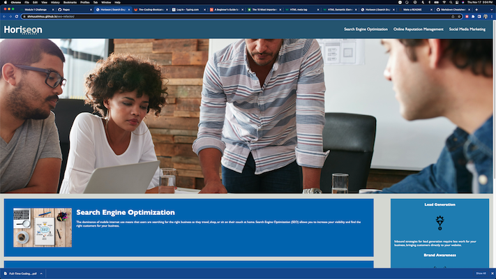

# seo-refactor

[Link to my project](https://shmuushmuu.github.io/seo-refactor/)

## Table of Contents
- [Description](#description-of-project)
- [Visuals](#visuals)

## Description of Project
This project was to clean up the html and CSS of the website for a company named Horiseon, who specializes in search engine optimization, social media marketing, and online resource management. 

I learned how to clean up semantics, how to make comments, and the benefit of utilizing Git commands while working. I enjoyed the debugging, and I think I may enjoy this side of development moreso than creating my own code.

## Visuals
The website should look like this:

